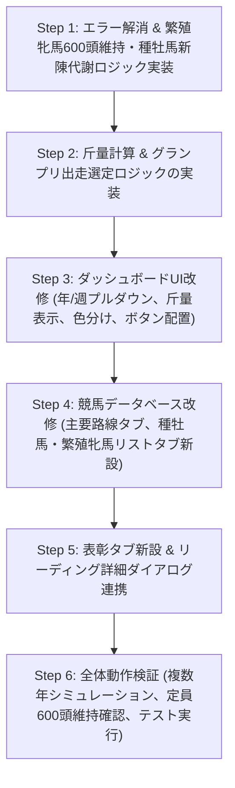

# Phase 8 総合実装計画書

## 概要
本計画は、ユーザー様からご提示いただいた **Phase 8 の全実装要件** および **繁殖牝馬600頭定員維持・入れ替えルール** を統合した総合実装計画です。
システムの安定動作（エラー解消）を担保しつつ、ゲーム性・リアリティ・UI操作性を大幅に向上させます。

---

## 1. コアロジック & ルール改修

### 1.1 繁殖牝馬の定員600頭維持 & 入れ替えルール (最優先)
- **定員**: 現役繁殖牝馬（`dams.is_active = 1`）を常に **600頭** に維持。
- **入れ替えフロー**:
  - **A (確定昇格)**: 今年度引退する牝馬のうちオープン馬（重賞勝ち馬、OP/L勝ち馬、3勝クラス勝ち上がり・収得賞金1600万円以上）は繁殖牝馬確定。
  - **B (強制引退)**: 産駒デビュー後3年間勝ち星なし（最年長産駒4歳以上で全産駒0勝）の繁殖牝馬、および20歳定年の繁殖牝馬は引退。
  - **C (不足時補充)**: $(600 - B + A) < 600$ の場合、引退牝馬をスコア化（勝利数、賞金、重賞好走、能力値、母性活力）し、上位から不足分を昇格。
  - **D (超過時削減)**: $(600 - B + A) > 600$ の場合、「2年連続勝利なし（産駒通算0勝または直近2年未勝利）」の繁殖牝馬をスコア化し、下位（不振・高齢）から引退。不足時は高齢順に削減。

### 1.2 種牡馬の新陳代謝 & 海外種牡馬の導入
- **種牡馬引退**: 25歳定年、または3年連続産駒未勝利で引退（※活躍馬は最低3頭の種付け保証）。
- **新種牡馬選定**:
  - 優先1: 主要路線G1制覇馬（オープン馬）
  - 優先2: G1通算3勝以上（オープン馬）
  - 優先3: 重賞勝利数・3着内率・勝率・血統希少性のスコア順に、引退枠を補充する形で認定。
  - 各種リストで新種牡馬には緑文字で **[新]** を付与。
- **海外種牡馬の導入**:
  - 4年目以降、3年に1頭海外から種牡馬を導入。
  - 能力値: 全種牡馬の上位30%以上（最大1.1倍まで）。
  - 各種リストで海外種牡馬には赤文字で **[外]** を付与。

### 1.3 競走馬引退基準の厳格化
- **3歳9月4週**: 未勝利馬引退
- **4歳12月4週**: 1勝馬引退
- **5歳12月4週**: 牝馬全頭引退、牡馬条件馬引退
- **4歳以上オープン馬**: 成長曲線低下かつ近走不振馬は引退
- **7歳12月4週**: 全馬引退

### 1.4 負担重量（斤量）の導入 & グランプリ選定
- **斤量**: 牡牝の斤量差（牝馬2kg減）、年齢・グレードに応じた斤量計算を実装。出走馬表の「適性」列を「斤量」に変更。
- **グランプリ選定（宝塚記念・有馬記念・東京大賞典）**: レース間隔に関わらず、その時点での芝・ダート成績上位8頭を最優先選定。有馬記念・東京大賞典は3歳馬の出走も可能。

---

## 2. データベース & モデルの拡張

- `dams` テーブル: `consecutive_winless_years`（連続産駒未勝利年数）、`debut_year` 等のトラッキング列を確認・追加。
- `sires` テーブル: `is_imported`（海外種牡馬フラグ）、`debut_year`（初供用年フラグ）を追加。
- `sqlite3.Row` に対する辞書風アクセス（`.get()` 呼び出し等）によるエラーを全箇所修正。

---

## 3. UI・画面の大幅リニューアル

### 3.1 ダッシュボード（`DashboardView`）
- 「🎬 レースを見る」ボタンを「⏩ 次の週に進む」の左隣に配置。
- 週の切り替えを「年セレクタ」＋「週セレクタ」の2段階プルダウンに刷新。
- グループボックスの「[2行目]」「[3行目]」表記を削除し、すっきりとした洗練されたデザインに変更。
- **レース表示の色分け**:
  - 新馬: 黄緑 (`#84cc16`)
  - 未勝利: 明るい灰 (`#94a3b8`)
  - 条件戦: 水色 (`#38bdf8`)
  - リステッド: 黄色 (`#facc15`)
  - G3: 緑 (`#22c55e`)
  - G2: 青 (`#3b82f6`)
  - G1: 赤 (`#ef4444`)
- 出走馬表: 「適性」列を廃止し、「斤量 (kg)」列を新設。

### 3.2 タブ構成の整理
1. **ダッシュボード**
2. **競馬データベース**
   - **主要レース路線タブ (新設)**: 3歳牡馬3冠、3歳牝馬3冠、3歳ダート3冠、古馬短距離2冠、古ママイル2冠、古馬中距離2冠、古馬長距離2冠、古馬牝馬2冠、グランプリ2冠、ダート路線等の歴代勝ち馬を横並びマトリクス表示。
   - **種牡馬リストタブ (新設)**: 現役・全世代の種牡馬一覧（サイヤーライン、生産頭数、勝ち馬数、重賞成績）、クリックで生産馬一覧ダイアログを表示。
   - **繁殖牝馬リストタブ (新設)**: 現役・全世代の繁殖牝馬一覧、クリックで生産馬一覧ダイアログを表示。
   - **血統表・競走馬検索**
3. **表彰 (新設独立タブ)**
   - **年度代表馬・各部門賞**: 歴代受賞馬一覧。
   - **関係者部門賞**: 最多勝騎手・最多勝調教師・最多勝馬主・最多勝生産牧場・最多勝新人騎手・最多勝新人調教師。
   - **顕彰・殿堂・メモリアル**: 顕彰馬・殿堂入り騎手・調教師・100勝メモリアル。
4. **各種リーディング**
   - 騎手・調教師: 年齢＋年数（○年目）、新人に緑字で **[新]**。
   - 各種数値セル（持ち馬数、勝ち馬数、生産頭数等）のクリックで詳細競走馬リストダイアログを表示。
   - サイヤーリーディング: 新種牡馬に **[新]**、海外種牡馬に **[外]** を表示。
5. **シミュレーション状況 (最後尾へ移動)**
   - 進行コントロール・実行ログに加え、**生産牧場・馬主の規模階層（動的変化）** タブをここに統合。

---

## 4. 実装ステップ

---

## 5. 検証計画
- **繁殖牝馬定員テスト**: 10年間以上のシミュレーションを実行し、毎年の繁殖牝馬数が常に600頭で推移することを確認。
- **海外種牡馬・新種牡馬テスト**: 4年目以降に海外種牡馬が3年周期で導入され、G1勝ち馬が新種牡馬として昇格することを確認。
- **UI表示テスト**: 各種プルダウン、色分け、新規タブ（主要レース路線、種牡馬・繁殖牝馬リスト、表彰）、各クリックポップアップが正常に動作することを確認。
- **単体テストスイート**: 全テストが正常にパスすることを確認。
