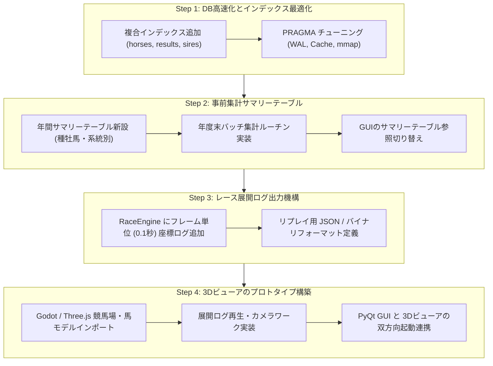

# 競馬シミュレーション 今後の開発・最適化・3D化計画ロードマップ

本ドキュメントは、シミュレーション年数の長期化に伴うデータベース高速化手法、およびレースシーン等の3Dグラフィック導入に向けたアーキテクチャ設計とロードマップをまとめた計画書です。

---

## 1. 全体の処理高速化・データベース肥大化対策

### 1.1 現状の課題分析
* シミュレーション年数が増えるにつれ、`results`（レース結果：年間数千〜数万行）、`horses`（引退馬・当歳馬）、`odds` などのテーブルレコードが累積します。
* データベース画面やランキング画面で `GROUP BY` や `JOIN` を含む集計クエリを実行する際、全件フルスキャンが発生してGUI描画が重くなる原因となります。

### 1.2 高速化のための具体策

#### ① 複合インデックス（Composite Index）の最適化【即効性：高】
* 頻繁に `WHERE` や `JOIN`、`ORDER BY` で使用されるカラムに適切な複合インデックスを追加します。
* **追加推奨インデックス例**:
  ```sql
  -- 競走馬の現役判定・世代・父母結合用
  CREATE INDEX IF NOT EXISTS idx_horses_active_age ON horses(is_active, age, is_dead);
  CREATE INDEX IF NOT EXISTS idx_horses_sire_dam ON horses(sire_id, dam_id);
  CREATE INDEX IF NOT EXISTS idx_horses_prize ON horses(prize_money DESC);

  -- レース結果の年度別・馬別・着順別集計用
  CREATE INDEX IF NOT EXISTS idx_results_horse_pos ON results(horse_id, finish_position);
  CREATE INDEX IF NOT EXISTS idx_results_race_id ON results(race_id, finish_position);
  CREATE INDEX IF NOT EXISTS idx_races_year_grade ON races(year, grade);

  -- 種牡馬・繁殖牝馬の稼働状態・系統用
  CREATE INDEX IF NOT EXISTS idx_sires_active_line ON sires(is_active, sire_line);
  CREATE INDEX IF NOT EXISTS idx_dams_active ON dams(is_active);
  ```

#### ② 統計サマリーテーブル（事前集計テーブル）の導入【推奨度：高】
* 画面を開くたびに全履歴から `SUM` / `COUNT` / `MAX` を再計算するのではなく、**年度末の進行時（年送り処理時）に1年分の集計結果をサマリーテーブルへ書き込む** アーキテクチャです。
* **新設テーブル案**:
  * `sire_yearly_stats`（種牡馬ID, 年, 出走数, 勝馬数, 重賞勝数, 獲得賞金, AEI等）
  * `lineage_yearly_stats`（サイアーライン名, 年, 現役頭数, 種牡馬数, 繁殖牝馬数, 重賞勝数）
  * `horse_yearly_leading`（年, 区分, 順位, 馬ID, 賞金, 勝数）
* **効果**: GUIの読み込みが $O(N)$（全履歴検索）から $O(1)$（1行取得）となり、何百年進めても一瞬で表示可能になります。

#### ③ SQLiteのエンジンチューニング（PRAGMA設定）
* データベース接続時に以下のPRAGMAを実行し、メモリキャッシュとログ書き込みを最適化します。
  ```python
  # WALモード（読み書きの競合を防ぎ高速化）
  conn.execute("PRAGMA journal_mode = WAL;")
  # メモリキャッシュ拡大（例: 64MB）
  conn.execute("PRAGMA cache_size = -64000;")
  # メモリマップトI/Oの有効化（256MB）
  conn.execute("PRAGMA mmap_size = 268435456;")
  # 外部キー制約の最適化
  conn.execute("PRAGMA synchronous = NORMAL;")
  ```

#### ④ 年度別アーカイブ分割（年次データベース分割）
* 10年または20年ごとに過去のレース結果詳細（`results`, `race_lap_times` 等）を `data/archive_year_1_10.db` のようなアーカイブDBへ切り離し、メインDBには血統・通算成績・年度別サマリーのみを残す方式です。

#### ⑤ GUI側の遅延ロード（Lazy Load）と非同期ワーカースレッド（QThread）
* 画面切り替え時にメインスレッド（UI）でDBクエリを実行せず、`QThread` / `QRunnable` を用いてバックグラウンドでクエリを実行し、結果が返り次第テーブルに描画することで、画面の引っかかり・フリーズを完全に排除します。

---

## 2. 3Dグラフィック導入アーキテクチャ

### 2.1 レースシミュレーションと3D描画の分離設計
競馬シミュレーションにおいて、**「能力・展開の計算（Pythonバックエンド）」** と **「3Dモデル・アニメーション描画（グラフィックエンジン）」** を綺麗に分離することが業界標準のベストプラクティスです。

```
+-------------------------------------------------------------+
|               Python シミュレーションコア (Back-end)         |
|  - 競走馬能力・血統・成長・配合・年進行                     |
|  - レース物理演算・ペース・コース取り・走破タイム確定       |
|  - データベース (SQLite) 管理                               |
+-------------------------------------------------------------+
                              │
                              ▼ レース展開ログ (JSON / SQLite / IPC)
+-------------------------------------------------------------+
|               3Dグラフィック描画エンジン (Front-end)         |
|  - 競馬場3Dモデル・天候・芝/ダートシェーダー                |
|  - 馬・騎手3Dボーンモデル & 走行アニメーション              |
|  - カメラワーク (実況カメラ、追走カメラ、パトロールビデオ)   |
|  - 実況テキスト・タイム表示・着順掲示板                     |
+-------------------------------------------------------------+
```

### 2.2 3Dエンジンの選定・比較

| 候補 | 特徴 | 連携方法 | 評価 |
| :--- | :--- | :--- | :---: |
| **Godot Engine (GDScript / C#)** | ・軽量、起動が極めて高速、完全無料・商用フリー<br>・SQLiteを標準サポートし、Pythonが出力したDB/JSONを直接読み込み可能<br>・アニメーションシステムが使いやすい | SQLite直接参照<br>または JSON展開データ受渡し | **最推奨 ⭐⭐⭐** |
| **Three.js / WebGL (Tauri / Electron)** | ・ブラウザ・Web技術で動作し、UIと3Dの親和性が高い<br>・Pythonのローカルサーバー（FastAPI）からWebSocketでリアルタイム座標同期 | WebSocket / HTTP / JSON | **推奨 ⭐⭐⭐** |
| **Unity (C#)** | ・Asset Storeに競走馬モデルやリアルな競馬場アセットが多数存在<br>・最高峰のグラフィック表現が可能だが、容量・起動負荷がやや大きい | IPC (パイプ通信) / gRPC / JSONファイル | **高品質重視 ⭐⭐** |
| **Panda3D / ModernGL (Python完結)** | ・Pythonコード内だけで完結できる | アプリ内直接呼び出し | **難易度高（自前実装多） ⭐** |

### 2.3 おすすめの連携アプローチ（Godot Engine 方式）
1. **Python側**: レースシミュレーション実行時に、各馬の0.1秒ごとのコース座標 $(X, Y, Z)$、速度、脚色（手応え）、フォーム状態を軽量な展開JSON（または一時テーブル）に出力。
2. **Godot側**: 生成された展開データを受け取り、3D空間上の馬モデルを座標に沿って補間移動させながら、走法アニメーション（ギャロップ、鞭、追い比べ）を再生。
3. **カメラワーク**: 放送用TVカメラ、先頭追走カメラ、特定馬固定カメラなどを切り替え可能にする。

---

## 3. 実装ロードマップ



### Phase A（即時実施可能）
* `horses`, `results`, `races`, `sires`, `dams` への複合インデックス作成。
* `PRAGMA journal_mode = WAL;` の適用。

### Phase B（中期）
* 年間集計サマリーテーブルの導入によるデータベース画面・ランキング画面の完全レスポンス化。
* GUIの非同期読み込み（バックグラウンドクエリ）。

### Phase C（長期・3D化）
* レース展開ログ（0.1秒単位の進行データ）のエクスポート機能。
* Godot Engine または WebGL（Three.js）を用いた3Dレースリプレイビューアのプロトタイプ作成。
