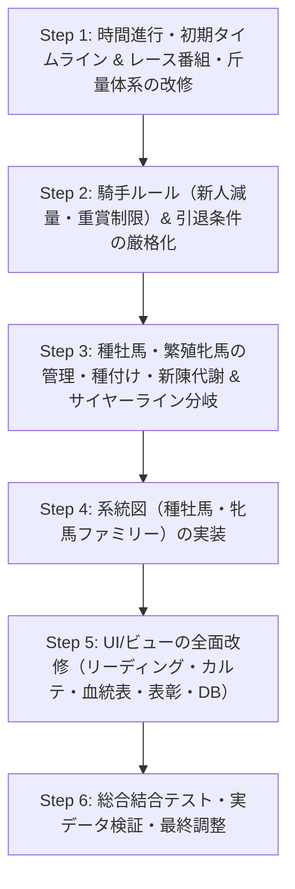

# 📋 Implementation Plan: 0925 総合改修・機能拡張計画書

本計画書は、`md/0925修正事項.txt` に基づき、シミュレーター全体の仕様変更・機能追加を段階的に検証しながら安全に実装するためのロードマップです。

---

## 🗺️ 全体アーキテクチャ・進行フロー

---

## 📌 段階別実装詳細

### ■ Step 1: 時間進行タイムライン & レース番組・斤量体系の改修
> **目的**: 1〜3年目の初期タイムラインの確立、および定量・別定・ハンデ戦と条件戦の出走機会均等化。

1. **時間の進め方の再構築**
   - 対象ファイル: `src/generators/initializer.py`, `src/race/calendar.py`
   - 仕様:
     - **1年目**: 初期種牡馬(60頭)×初期繁殖牝馬(600頭)から600頭の初子が誕生（当歳0歳）＋当年4月交配（600頭受胎）。レース開催は行わない。
     - **2年目**: 1年目産駒が1歳幼駒に成長、2年目産駒600頭が誕生＋当年4月交配。レース開催は行わない。
     - **3年目**: 1年目産駒が2歳となり、**3年目7月（第27週）から2歳新馬戦が正式スタート**。

2. **レース斤量種別（定量・別定・ハンデ）の完全登録 & ハンデ算出**
   - 対象ファイル: `src/race/annual_program.py`, `src/models/race.py`, `src/race/entry.py`
   - 仕様:
     - リストに準拠し、全重賞（G1・G2・G3）、リステッド（L）、特別競走の斤量種別（`定量` / `別定` / `ハンデ`）を定義。
     - **ハンデ戦の斤量計算**: 出走馬の総合能力値（スピード・スタミナ・瞬発力・耐久力等）を指数化。出走メンバーの平均値を55.0kgとし、1.0kg刻みで割り振り（下限48.0kg、上限62.0kg）。

3. **条件レースの拡充と出走機会均等化**
   - 対象ファイル: `src/race/annual_program.py`, `src/race/entry.py`
   - 仕様:
     - 1戦0勝で引退してしまう馬や、2勝C・3勝Cで半年以上出走間隔が空く事態を防ぐため、番組表の開催数・距離バリエーションを再編集。
     - 出走登録（`RaceEntryEngine`）において、前走出走からの間隔が長い馬を優先的に選出する優先出走ルールを適用。

---

### ■ Step 2: 騎手ルール（新人減量・重賞制限）& 引退条件の厳格化
> **目的**: 騎手キャリア制限の実装と、競走馬引退ルールの完全徹底。

1. **新人騎手の斤量減 & 重賞出走制限**
   - 対象ファイル: `src/models/jockey.py`, `src/race/entry.py`, `src/race/engine.py`
   - 仕様:
     - 通算50勝以下: **斤量 2.0kg 減**（▲ / 減量記号）
     - 通算51〜100勝 または デビュー5年目終了まで: **斤量 1.0kg 減**（☆ / 減量記号）
     - 通算100勝以下 かつ デビュー5年目以内: **重賞レース（G1・G2・G3）への騎乗不可（出走制限）**。

2. **競走馬引退条件の厳格徹底**
   - 対象ファイル: `src/core/lifecycle.py`, `src/race/calendar.py`
   - 仕様:
     - **3歳馬**: 9月4週終了時点で未勝利の馬は100%全頭引退（繁殖牝馬昇格不可）。
     - **4歳馬**: 12月4週終了時点で条件馬（1勝C/2勝C/3勝C）は100%引退。
     - **5歳牝馬**: 12月4週時点で100%全頭引退。
     - **5歳牡馬**: 12月4週時点で成長曲線が下降期に入り、かつ成績不振の馬は引退。
     - **6歳牡馬**: 12月4週時点で成長曲線が下降期に入り、かつ成績不振の馬は引退。
     - **7歳牡馬**: 12月4週時点で100%全頭引退。

---

### ■ Step 3: 種牡馬・繁殖牝馬の管理・種付け・新陳代謝 & サイヤーライン分岐
> **目的**: 5〜6年目を軸とする高度な生産・交配・種付け数按分・サイヤーライン進化。

1. **種牡馬の種付け頭数・引退ロジック**
   - 対象ファイル: `src/core/lifecycle.py`, `src/core/breeding.py`
   - 仕様:
     - 初年度〜5年目: 一律10頭を種付け。
     - 6年目以降: 現役産駒の通算勝利数0頭で引退、25歳定年で引退。
     - 5年目終了時以降の種付け頭数按分ルール:
       - (1) 過去3年間の競走馬でG1馬を輩出: `現在頭数 × 1.5`（最大30頭）
       - (2) 過去3年間の競走馬で重賞馬を輩出: `現在頭数 × 1.2`（最大30頭）
       - (3) その他: `現在頭数 × 0.8` をベースとしつつ、総生産頭数600頭から(1)(2)および1〜5年目種牡馬（各10頭）を引いた残枠を按分（最低1頭保証）。

2. **繁殖牝馬の優先交配・制限 & 6年目入れ替え**
   - 対象ファイル: `src/core/lifecycle.py`, `src/core/breeding.py`
   - 仕様:
     - 2月4週終了時に繁殖牝馬の能力値をスコア化し、上位牝馬から優先的に上位種牡馬と交配。
     - 同一種牡馬との再交配: 過去産駒がG1勝利した場合のみ許可（最大3頭まで）。
     - 禁止配合: 父馬同一、母馬同一、血量25.0%超過。
     - 繁殖牝馬になってから1〜5年目は毎年種付け可能。
     - 入れ替えルール: 引退時オープン馬が繁殖入り。5年目終了後（6年目2月4週）に現役産駒成績（G1数・重賞実績・勝馬率等）でランキング作成。新規繁殖牝馬頭数分を下位牝馬と入れ替え（3月1週誕生後）。総数600頭を厳密維持。

3. **動的サイヤーライン（●●系）分岐システム**
   - 対象ファイル: `src/core/lifecycle.py`, `src/models/horse.py`
   - 仕様:
     - 基本は初期種牡馬名＋系。
     - 分岐条件: 自身の直系子が2頭以上種牡馬入りし、かつその子種牡馬の産駒がさらに種牡馬入りした場合、新たに「種牡馬名＋系」を創設し、自身および以降の子孫のサイヤーラインを一括更新。

---

### ■ Step 4: 系統図（種牡馬・牝馬ファミリーナンバー）の実装
> **目的**: 視覚的・構造的な系統樹ビューの構築。

1. **系統データ構造 & 生成アルゴリズム**
   - 対象ファイル: `src/core/pedigree.py`, `src/models/pedigree_tree.py`
   - 仕様:
     - サイヤーライン系統樹（父系ツリー）の全世代階層構築。
     - メアライン系統樹（牝系・ファミリーナンバー）の追跡・構築。

2. **GUI 系統図ウィジェット・タブ**
   - 対象ファイル: `src/gui/views/database_view.py`（新規「🌳 系統図」タブ）
   - 仕様:
     - 展開・折りたたみ可能なツリー表示（QTreeWidget / ダイナミックノードグラフ）。
     - 各馬ノードをクリックすることで、種牡馬カルテ・繁殖牝馬カルテ・競走馬詳細へ遷移可能。

---

### ■ Step 5: UI/ビューの全面改修
> **目的**: 全画面のフォーマット・配色・デザインの指定対応。

1. **各種リーディング & サイヤーリーディング**
   - 対象ファイル: `src/gui/views/rankings_view.py`
   - 仕様:
     - 代表産駒を最大3頭表示（個別列化、各馬クリックで競走成績表示）。
     - サイヤーリーディング世代別カラーリング（第1世代白、以降6〜8色のパレットローテーション）。
     - 新種牡馬に3年間 `[新]`、海外種牡馬に引退まで `[外]` バッジ表示。
     - サイヤーラインの後ろに「父：○○ / 母：○○」を併記。

2. **競走馬情報ダイアログ & 5代血統表**
   - 対象ファイル: `src/gui/views/horse_detail_dialog.py`, `src/gui/widgets/pedigree_widget.py`
   - 仕様:
     - ヘッダー右側にサイヤーライン（○○系）を表示。
     - 出走履歴テーブルに「騎手」「斤量」列を追加。
     - 5代血統表の各セルに「生誕年」「通算成績(1-2-3-外)」「G1勝利数」を表示。
     - 最多配合種牡馬の組み合わせ血量・ニックス表示。
     - 父母クリック時に新しいウィンドウで詳細を開く。
     - 成績詳細集計テーブルの黒背景化・ハイコントラスト視認性向上。

3. **種牡馬カルテ & 繁殖牝馬カルテ**
   - 対象ファイル: `src/gui/views/sire_detail_dialog.py`, `src/gui/views/dam_detail_dialog.py`
   - 仕様:
     - 主な成績表示をG1レースのみに限定。
     - 産駒一覧の成績表示を `1着-2着-3着-着外`（数字とハイフンのみ、例: `3-1-0-2`）に変更。
     - 産駒一覧の重賞成績表示を `G1-G2-G3`（数字とハイフンのみ、例: `1-0-2`）に変更。

4. **表彰・データベース・重賞DB・コースレコード**
   - 対象ファイル: `src/gui/views/awards_view.py`, `src/gui/views/database_view.py`
   - 仕様:
     - 表彰から「最多勝新人騎手」「最多勝厩舎」を削除。
     - 受賞馬名クリックで競走馬詳細を表示。殿堂馬等の後ろにサイヤーライン・父母を記載。
     - 競走馬リーディング・世代年鑑に父母名を併記。
     - 主要レース路線プルダウンの順序変更（「グランプリ2冠」⇔「ダート王道」）。
     - 海外種牡馬の基礎能力値（気性/耐久/活力）を他能力値と同様の計算式に補正。
     - 重賞レースDBの週表示を「○月○週」形式に変更。
     - コースレコード画面に達成年を表示。

---

### ■ Step 6: 総合結合テスト・実データ検証・最終調整
> **目的**: 全体を通したシミュレーション実行とテストスイート合格確認。

1. **年次シミュレーション検証**
   - 1年目〜10年目までの連続年進行を実行。
   - 1〜2年目の無レース＆出産、3年目7月の2歳戦開幕、6年目の種付け数按分＆牝馬入れ替え、サイヤーライン分岐が意図通り動作することを確認。
2. **ユニットテストの全件パス**
   - 全自動テストスイートを実行し、エラー・リグレッションがないことを確認。

---

## 📌 進め方の提案

各ステップの実装完了ごとに動作確認・テストを実施し、ユーザー様にご報告・ご確認いただきながら次のステップへ進める形を提案いたします。
